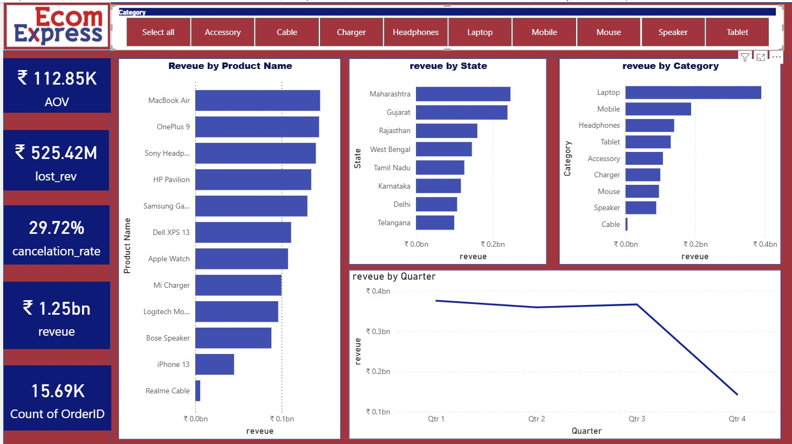
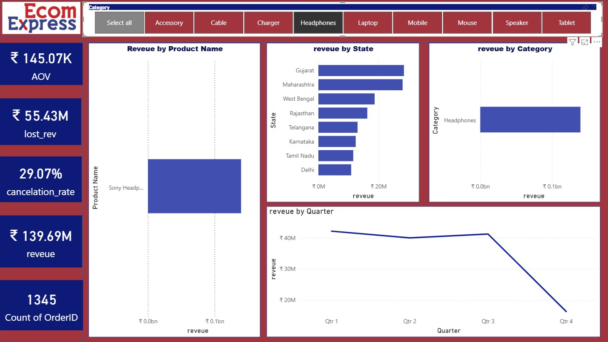
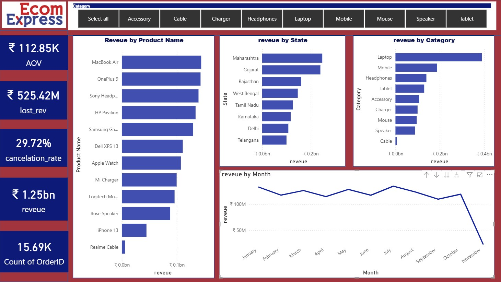

# 📊 E-Commerce Sales Dashboard | Power BI

An interactive **Power BI dashboard** designed to analyze and visualize e-commerce sales performance across products, categories, and regions. The dashboard provides actionable insights through dynamic filters, KPI cards, and interactive charts to support data-driven business decisions.

---

## 🚀 Project Overview

This dashboard helps stakeholders monitor key business metrics such as **Revenue, Average Order Value (AOV), Cancellation Rate, and Order Count** while exploring sales performance by **product, category, state, and time period**.

It demonstrates practical skills in **Power BI, DAX, Data Modeling, Power Query, and Business Intelligence**.

---

## 📸 Dashboard Preview

### Main Dashboard


---

### Interactive Category Filter

Users can filter the entire dashboard by selecting a product category.



---

### Revenue Analysis Dashboard

Revenue trends can be analyzed across products, states, and quarters.



---

## 📈 Key Performance Indicators (KPIs)

- 💰 **Total Revenue:** ₹1.25 Billion
- 🛒 **Average Order Value (AOV):** ₹112.85K
- ❌ **Cancellation Rate:** 29.72%
- 📦 **Total Orders:** 15.69K
- 💸 **Lost Revenue:** ₹525.42 Million

---

## 📊 Dashboard Features

- Revenue by Product Name
- Revenue by Category
- Revenue by State
- Quarterly Revenue Trend
- Interactive Category Slicer
- Dynamic KPI Cards
- Cross-filtering across all visuals

---

## 🛠️ Tools & Technologies

- **Power BI**
- **Power Query**
- **DAX**
- **Microsoft Excel**
- **Data Modeling**
- **Data Visualization**

---

## 📌 Business Insights

- Laptops generate the highest revenue among all product categories.
- Maharashtra and Gujarat contribute the highest sales revenue.
- Revenue remains relatively stable for the first three quarters before declining significantly in Q4.
- A small number of products contribute a major share of overall revenue.
- Interactive category filters allow users to perform focused analysis for individual product segments.

---

## 📂 Repository Structure

```
Ecommerce-Sales-Dashboard/
│
├── Ecommerce_Sales_Dashboard.pbix
├── Dataset.xlsx
├── pbiproj1.jpg
├── pbiproj1-2.jpg
├── pbiproj-3.jpg
└── README.md
```

---

## 🎯 Skills Demonstrated

- Data Cleaning & Transformation
- Data Modeling
- DAX Measures & Calculated Columns
- Dashboard Design
- KPI Development
- Business Intelligence
- Data Storytelling
- Interactive Reporting

---

## 💡 Future Improvements

- Add customer segmentation analysis
- Include profit and margin analysis
- Build sales forecasting using time-series models
- Integrate SQL as the data source
- Publish the dashboard to Power BI Service for live access

---

## 👩‍💻 Author

**Megha Hajela**

Aspiring Data Analyst | AI & ML Enthusiast

- 💼 Skilled in Power BI, SQL, Python, Excel, and Data Visualization
- 📊 Passionate about transforming raw data into actionable business insights

---

⭐ If you found this project useful, consider giving it a **star** on GitHub!
